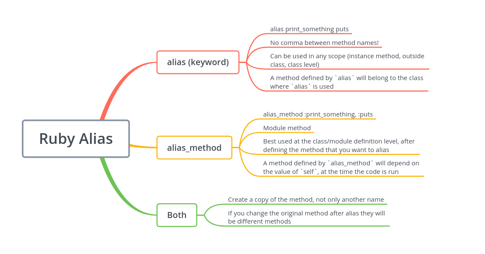

# Use alias to overwrite method

Instead of using inheritance, we can extend method wich we has from module. Just use alias

```ruby
module MyModule
  def my_method
    'my_method from MyModule'
  end
end

class MyClass
  include MyModule

  alias my_method_from_module my_method

  def my_method(stubbed)
    if stubbed == true
      'my_method from MyClass'
    else
      my_method_from_module
    end
  end
end

puts MyClass.new.my_method(true)
# my_method from MyClass
puts MyClass.new.my_method(false)
# my_method from MyModule
```

## How does it work?

`alias` creates a copy of the method, not only another name. If you change the original method after alias they will be different methods



[source](https://www.rubyguides.com/2018/11/ruby-alias-keyword/)
